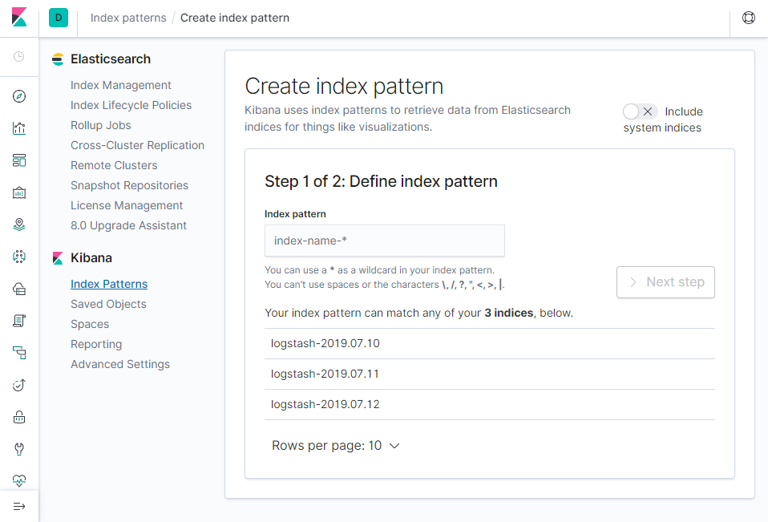

# EFK Stack installation
This repository contains necessary kubernetes manifests and helm charts for installing EFK (Elasticsearch, Fluentd and Kibana) stack onto your kubernetes cluster. 

## Prerequisites 
* A Kubernetes v1.10+ cluster with enabled RBAC 
* ```kubectl``` or ```helm``` tool used for installation 

## Details
Manifests and charts do following:
1. Create logging namespace
2. Create local ```PersistentVolumes``` on nodes
3. Configure and launch scalable Elasticsearch cluster using ```Services``` and ```SatefulSet```
4. Create Kibana Kubernetes ```Service``` and ```Deployment```
5. Set up Fluentd ```DaemonSet``` to report logs from every node to the Elasticsearch


## Installing
If you are planning to use local ```PersistentVolumes``` for storage be sure check that provided in chart/manifest folder exists on nodes. If not you can manually create them or use ansible playbook. 
```bash
ansible-playbook -i ansible/hosts ansible/create-folder.yml -K
```

You can install EFK stack using either helm chart or manifests 
### Chart
To install the chart with release name efk
```bash
helm install helm/efk --name efk
```

### Manifests
Manifests should be installed in certain order

Firstly create namespace
```bash
kubectl create -f k8s/kube-logging.yml
```
If you are planning to use local ```PersistentVolumes``` for storage
```bash
kubectl create -f k8s/local-pv
```

Then install elasticsearch ```Service``` and ``StatefulSet``
kubectl create -f k8s/elastic-search
```bash
kubectl create -f k8s/elastic-search
```

Install Kibana ```Service``` and ```Deployment```
```bash
kubectl create -f k8s/kibana
```

And at last install fluentd
```bash
kubectl create -f k8s/fluentd
```

## Usage 
After installing we should check if everything is working correctly.

First, be sure to check that there is no errors in kubernetes and every pod is functioning and running. 

For example, if you installed ELK Stack in ```kube-logging``` namespace, you can do this by running following command 
```bash
kubectl get all -n kube-logging
```
Then you should check if Elasticsearch connected to necessary services. You can do this by using ```proxy``` command or forwarding provided ports. 

For example, if yours Elasticsearch REST API located on default port 9200 you can do by running following command

```bash
kubectl port-forward es-cluster-0 9200:9200 -n kube-logging
``` 
After this you should be able to perform curl request against said API like so
```bash
curl http://localhost:9200/_cat/indices?v
```
Output should look somewhat similar to this
```bash
# Output
health status index                uuid                   pri rep docs.count docs.deleted store.size pri.store.size
green  open   logstash-2019.07.12  pxSPLgM2RgCNtNXeH6mBZg   1   1      19027            0     25.8mb         12.3mb
green  open   .kibana_1            2S6pp2exS9-YtnqhKSTOIg   1   1          7            0     71.3kb         35.6kb
green  open   .kibana_task_manager Xkn8a_o_TGWiQwRoWSduBA   1   1          2            0    107.5kb         53.7kb
green  open   logstash-2019.07.10  fOd3K8w_SnC-sWB1vbTwqQ   1   1       7014            0      3.9mb          2.2mb
green  open   logstash-2019.07.11  gi2_Im8fQkCQz1x5H04Phg   1   1     214894            0    115.9mb         56.5mb
```

If everything checks out if now can login to the Kibana front-end using the same port-forwarding technique. 
```bash
kubectl port-forward [yours particular kibana pod name] 5601:5601 -n kube-logging
```
If everything is fine you can create new index pattern (try something like ```logstash-*```) and start working with EFK stack



## Uninstalling
### Chart 
Just run following ```helm``` command
```bash
helm del --purge efk
```
### Manifests 
To uninstall manifests you can delete all manifests from k8s folder like so
```bash
kubectl delete -f k8s/
```
## Chart configuration

The following tables lists the configurable parameters of the efk chart and their default values.
### Main

| Parameter                      | Description                                                 | Default            |
| -------------------------------| ------------------------------------------------------------| -------------------|
| `logNamespace`                 | Namespace for EFK stack to be deployed to                   | `kube-logging`     |
| `storage.name`                 | Name of `StorageClass` for local Volumes                    | `my-local-storage` |
| `storage.capacity`             | Capacity of each local `PersistentVolume`                   | `10Gi`             |                      
| `storage.localPath`            | Path to local folder on each node                           | `/mnt/disk/vol1`   |
| `storage.nodes`                | List of nodes where `PersistentVolume` should be provisioned| `[node2, node3]`   |
| `elasticsearch.replicas`       | Number of replicas of elastic-search                        | `2`                |
| `elasticsearch.limits.cpu`     | Limit of cpu usage by elastic-search                        | `300m`             |
| `elasticsearch.requests.cpu`   | Request of cpu usage of elastic-search                      | `50m`              |
| `elasticsearch.ports.rest`     | REST API elastic-search port                                | `9200`             |
| `elasticsearch.ports.internode`| Port for communication between nodes                        | `9300`             |
| `kibana.port`                  | Port for accessing kibana front-end                         | `5601`             |
| `kibana.replicas`              | Number of replicas of kibana                                | `1`                |
| `kibana.limits.cpu`            | Limit of cpu usage by kibana                                | `300m`             |
| `kibana.requests.cpu`          | Request of cpu usage of kibana                              | `50m`              |
| `fluentd.limits.memory`        | Limit of memory usage by fluentd                            | `512Mi`            |
| `fluentd.requests.cpu`         | Request of cpu usage of fluentd                             | `100m`             |
| `fluentd.limits.memory`        | Request of memory usage of fluentd                          | `200Mi`            |

### Images
| Parameter                      | Description                                                 | Default            |
| -------------------------------| ------------------------------------------------------------| -------------------|
| `images.elasticsearch`         | Image of elastic-search                                     | `docker.elastic.co/elasticsearch/elasticsearch:7.2.0`|
| `images.kibana`                | Image of kibana                                     | `docker.elastic.co/kibana/kibana:7.2.0`|
| `images.fluentd`               | Image of fluentd                                     | `fluent/fluentd-kubernetes-daemonset:v1.4.2-debian-elasticsearch-1.1`|